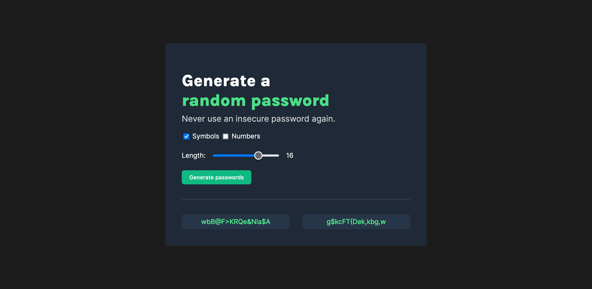
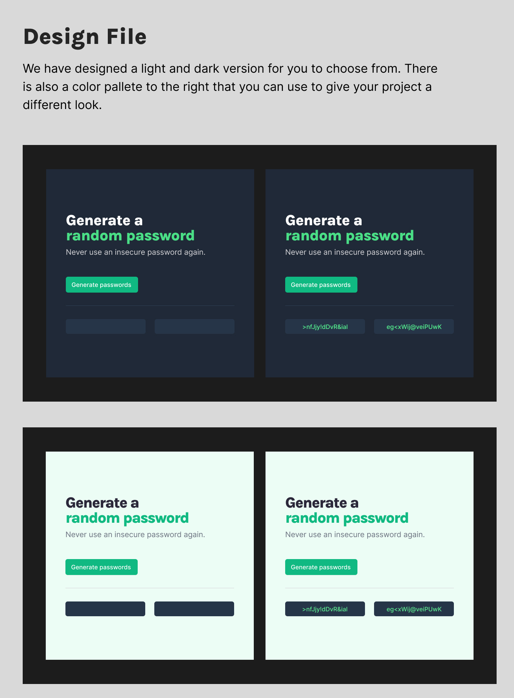

# Password Generator: A Scrimba Project

My solution to a password generator project from Scrimba. The goal of this project was to use HTML, CSS, and JavaScript to turn a Figma design into reality. The website can generate a random word with a user-defined length from 6 to 20 characters. Users can also set whether they want to include symbols or numbers inside their generated passwords.

## Table of contents

- [Overview](#overview)
  - [Requirements](#requirements)
  - [Stretch Goals](#stretch-goals)
  - [Screenshots](#screenshot)
  - [Link](#links)
- [Author](#author)

# Overview

## Requirements:

- Build it from "scratch" ✅
- Generate two random passwords when user clicks the button ✅
- Each password should be 15 characters long ✅

## Stretch Goals:

- Ability to set password length ✅
- Add "copy-on-click" ✅
- Toggle "symbols" and "numbers" on/off ✅

## Screenshots

Final result:

Figma Design (reference):

## Link

[Live Demo](https://almanzarsaul.github.io/Password-Generator-Scrimba-Project/)

# Author

Saul Almanzar

- [GitHub](https://github.com/almanzarsaul)
